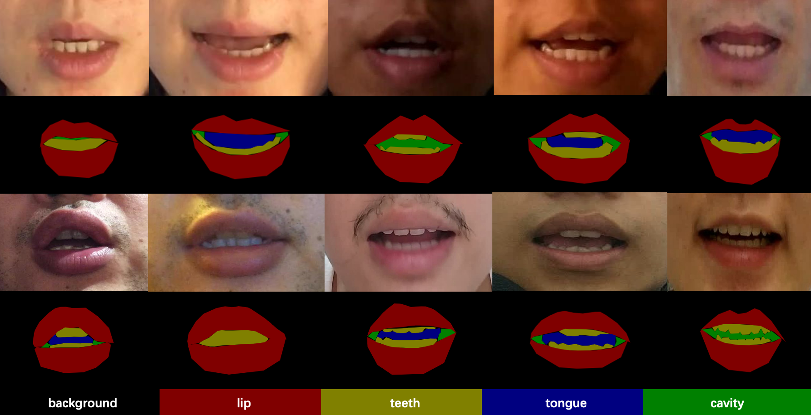

# FLRSeg

Fine-grained Lip Region Segmentation dataset.

Facial images are selected from Visual Speaker Authentication (VSA) dataset.
Lip region are localized and cropped to the center of images.

Five semantics categories are annotated.
Annotation conclude background(facial pixels), lip, teeth, tongue, inner cavity.

Please contact me (yangleisx@sjtu.edu.cn) for the full dataset.
