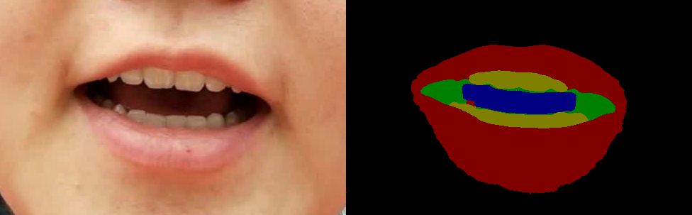
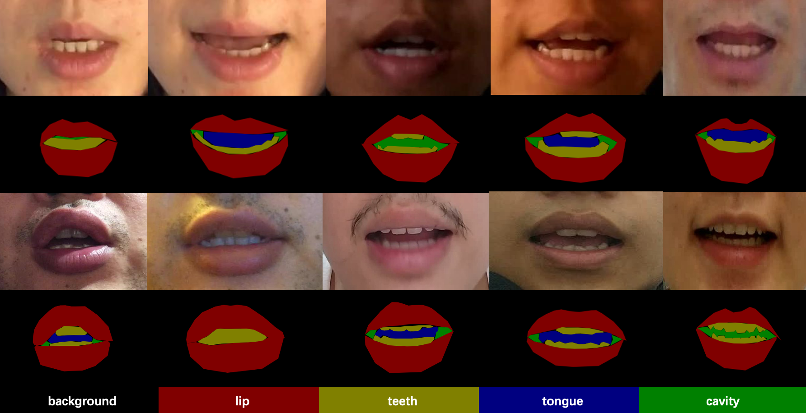

<h1 align="center">Fine-Grained Lip Image Segmentation using Fuzzy Logic and Graph Reasoning</h1>

<div align="center">

[Introduction](#Introduction) |
[Preparation](#Preparation) |
[Inference](#Speech-prediction) |
[License](#License)
</div>

## Authors

[Lei Yang](https://scholar.google.com/citations?user=YsaBzN4AAAAJ), [Shilin Wang](https://scholar.google.com/citations?user=8tg3mv0AAAAJ), [Alan Wee-Chung Liew](https://scholar.google.com/citations?user=CNgJ3LYAAAAJ)

## Introduction

This is the official implementation of [Fine-Grained Lip Image Segmentation using Fuzzy Logic and Graph Reasoning](https://ieeexplore.ieee.org/abstract/document/10192355). 

Using this repository, you can get fine-grained segmentation results of lip image in natural scenes.

## Demo

</img>

</img>

## Preparation

1. Clone the repository.

    ```bash
    git clone https://github.com/YangLeiSX/FLRSeg.git
    cd FLRSeg
    ```

2. Setup the environment.

    ```bash
    conda env create -f exvironments.yaml
    ```

3. Download the pre-trained model from [here](https://pan.baidu.com/s/1cTsmuPvIn6ohuR1AW_MGcQ)(key: bj38).

4. (optional) Crop lip images from face images.

    ```bash
    python crop_mouth.py
        --input face.jpg
        --output mouth.jpg
    ```

5. Inference lip images.

    ```bash
    python predict.py 
        --model weights/params-b5b19c.pth 
        --input mouth.jpg
        --multiscale
        --cuda
    ```

## Dataset

Fine-grained Lip Region Segmentation dataset.

Facial images are selected from Visual Speaker Authentication (VSA) dataset. Lip region are localized and cropped to the center of images.

Five semantics categories are annotated. Annotation conclude background(facial pixels), lip, teeth, tongue, inner cavity.

</img>

Please contact me with academic/institutional email for the full dataset.

## Citation

If you use the FLRSeg models and/or dataset, please consider citing the following paper:

```bibtex
@article{yang2023fine,
  title={Fine-Grained Lip Image Segmentation using Fuzzy Logic and Graph Reasoning},
  author={Yang, Lei and Wang, Shilin and Liew, Alan Wee-Chung},
  journal={IEEE Transactions on Fuzzy Systems},
  year={2023},
  publisher={IEEE},
  url={https://doi.org/10.1109/TFUZZ.2023.3298323},
  doi={10.1109/TFUZZ.2023.3298323},
}
```

## License

It is noted that the code can only be used for comparative or benchmarking purposes. Users can only use code supplied under a [License](./LICENSE) for non-commercial purposes.

## Contact

[Lei Yang](yangleisx@sjtu.edu.cn)
